# 02 — Database Design (SQL Server)

> Owners: Database Developer Agent (design) · Solution Architect Agent (review) · Status: **Draft v1**

## 1. Conventions

| Topic | Rule |
|---|---|
| Schemas | `iam` (identity/access), `tenancy`, `licensing`, `face`, `api` (API access & webhooks), `audit`, `ops` (notifications, outbox, usage, settings) |
| Keys | `uniqueidentifier` PKs generated app-side with `Guid.CreateVersion7()` (time-ordered → no page-split fragmentation). High-volume append-only tables (`ApiRequestLogs`, `AuditLogs`, `LicenseTransactions`) use `bigint IDENTITY` as clustered key. |
| Tenant column | `ClientId uniqueidentifier NOT NULL` on every tenant-owned table, **first column of every non-unique index**, FK to `tenancy.Clients`. Rows owned by "nobody" use the well-known platform tenant id (`PlatformTenant.ClientId`, a seeded system client) — **there are no nullable `ClientId` columns on tenant tables** (a NULL would be invisible to RLS and unwritable by the guard). Global reference tables (`Roles`, `Permissions`, `Plans`, `SystemSettings`, platform default cost rules) carry no `ClientId`; per-client overrides live in separate tenant-owned tables (e.g. `ClientCostRules`). |
| Audit columns | `CreatedAt datetime2(3)`, `CreatedBy uniqueidentifier NULL`, `UpdatedAt`, `UpdatedBy`, `IsActive bit` on mutable entities (set by `SaveChanges` interceptor). User asked for *CreatedDate/UpdatedDate*; we name them `CreatedAt/UpdatedAt` (same meaning, .NET convention) — all values UTC. |
| Concurrency | `RowVersion rowversion` on mutable aggregates (Clients, Licenses, ApiKeys, FaceProfiles). |
| Soft delete | Only `Clients` (and `Users`) — via `Status`. Everything else is hard-deleted when erasure applies (biometrics) or never deleted (ledgers). |
| Enums | Stored as `varchar(30)` with `CHECK` constraint (readable, safe to extend) — not tinyint. |
| Text | `nvarchar` for human text, `varchar` for codes/keys. Emails `nvarchar(256)`, collation `SQL_Latin1_General_CP1_CI_AS`. |
| Money-like | Credits are integers (`int`/`bigint`). No decimals → no rounding disputes. |
| Secrets | Never stored in plain text: passwords → Identity hash; API keys → SHA-256 hash; webhook secrets & face templates → AES-256-GCM envelope (`varbinary`) with `KeyId`. |

## 2. ERD (core)

```mermaid
erDiagram
  Clients ||--o{ ClientUsers : has
  Users ||--o| ClientUsers : "member of (v1: 1 client)"
  Users ||--o{ UserRoles : has
  Roles ||--o{ UserRoles : granted
  Roles ||--o{ RolePermissions : has
  Permissions ||--o{ RolePermissions : in
  Users ||--o{ RefreshTokens : owns
  Users ||--o{ LoginHistory : attempts
  Clients ||--o{ LoginHistory : scope
  Clients ||--o{ ClientSettings : configures
  Clients ||--o{ ClientKeys : "data keys"
  Plans ||--o{ Licenses : "template for"
  Clients ||--o{ Licenses : holds
  Licenses ||--o{ LicenseTransactions : ledger
  Clients ||--o{ LicenseCostRules : overrides
  Plans ||--o{ LicenseCostRules : defines
  Clients ||--o{ FaceProfiles : owns
  FaceProfiles ||--o{ FaceTemplates : has
  Clients ||--o{ FaceRecognitionRequests : makes
  FaceRecognitionRequests ||--o{ FaceMatchResults : returns
  FaceProfiles ||--o{ FaceMatchResults : candidate
  FaceRecognitionRequests ||--o| LicenseTransactions : charged_by
  Clients ||--o{ ApiKeys : owns
  ApiKeys ||--o{ ApiRequestLogs : used_in
  Clients ||--o{ WebhookEndpoints : registers
  WebhookEndpoints ||--o{ WebhookDeliveries : attempts
  Clients ||--o{ UsageLogs : rolled_up
  Clients ||--o{ Notifications : receives
  Clients ||--o{ AuditLogs : scope
  Users ||--o{ AuditLogs : actor
```



## 3. Table specifications

`PK` primary key · `FK` foreign key · `UQ` unique · `(A)` audit columns (CreatedAt, CreatedBy, UpdatedAt, UpdatedBy) · `RV` RowVersion

### 3.1 `iam` schema

**iam.Users** (our own entity; ASP.NET Core Identity's `PasswordHasher` hashes passwords, the user/role/permission model stays in the Domain) — `Id PK`, `ClientId` (tenant-owned: platform staff belong to the platform tenant; a user belongs to one client in v1), `Email`, `NormalizedEmail`, `UserName`, `NormalizedUserName`, `PasswordHash`, `SecurityVersion int` (bumped to invalidate sessions), `FullName nvarchar(150)`, `PhoneNumber`, `Status` (`Active|Inactive|Locked|PendingActivation`), `IsPlatformUser bit`, `MustChangePassword bit`, `LockoutEnd`, `LockoutEnabled`, `AccessFailedCount`, `TwoFactorEnabled`, `LastLoginAt`, `LastPasswordChangedAt`, `(A)`, `IsActive`.
Indexes: `UQ(NormalizedEmail)` (global uniqueness), `IX(ClientId, Status)`. Login looks users up by email in a narrowly scoped, reasoned platform scope (the only way to find a user before the tenant is known).

**iam.Roles** — global (no `ClientId`): `Id PK`, `Name varchar(60)`, `NormalizedName UQ`, `Scope` (`Platform|Client`), `IsSystem bit` (system roles cannot be edited/deleted), `Description`, `(A)`. Client-defined custom roles are a later feature and will use a separate tenant-owned table.

**iam.Permissions** — `Id PK`, `Key varchar(80) UQ` (e.g. `licenses.manage`), `Group varchar(40)`, `Scope` (`Platform|Client|Both`), `Description`. Seeded from `Contracts.Permissions` (code is the source of truth; a startup sync inserts missing keys, never deletes).

**iam.RolePermissions** — `RoleId FK`, `PermissionId FK`, `PK(RoleId, PermissionId)`.

**iam.UserRoles** — tenant-owned (carries the user's `ClientId`): `ClientId`, `UserId FK`, `RoleId FK`, `PK(UserId, RoleId)`. Constraint (app + trigger-free check in service): a user's roles must match its scope (platform users ↔ Platform roles).

**iam.RefreshTokens** — `Id PK`, `ClientId` (tenant-owned), `UserId FK`, `TokenHash binary(32)`, `FamilyId uniqueidentifier` (rotation chain), `ExpiresAt`, `AbsoluteExpiresAt`, `RevokedAt NULL`, `RevokedReason`, `ReplacedByTokenId NULL`, `CreatedAt`, `CreatedByIp varchar(45)`, `UserAgent nvarchar(300)`.
Indexes: `UQ(TokenHash)`, `IX(UserId, RevokedAt)`, `IX(FamilyId)`, `IX(ExpiresAt)` (purge). Re-use of a rotated token revokes the whole family.

**iam.LoginHistory** — `Id bigint IDENTITY PK`, `UserId NULL FK`, `ClientId` (platform tenant for unknown-email attempts), `EmailAttempted nvarchar(256)` (truncated, for unknown-user attempts), `Outcome` (`Success|InvalidCredentials|LockedOut|Inactive|ClientSuspended|MfaFailed|PasswordReset`), `FailureReason`, `IpAddress varchar(45)`, `UserAgent`, `CorrelationId`, `OccurredAt`.
Indexes: `IX(ClientId, OccurredAt DESC)`, `IX(UserId, OccurredAt DESC)`, `IX(IpAddress, OccurredAt)` (brute-force detection). Append-only.

> Standard Identity side tables (`UserClaims`, `UserLogins`, `UserTokens`, `RoleClaims`) are created in `iam` by the Identity model but not used in v1 except `UserTokens` (password-reset/email-confirm tokens).

### 3.2 `tenancy` schema

**tenancy.Clients** — `Id PK`, `Code varchar(30) UQ` (short slug, e.g. `ACME`), `Name nvarchar(150)`, `LegalName`, `ContactEmail`, `ContactPhone`, `AddressLine1/2`, `City`, `State`, `PostalCode`, `Country char(2)`, `Website`, `Industry`, `TimeZone varchar(64)` (IANA), `LogoBlobKey NULL`, `Status` (`PendingActivation|Active|Inactive|Suspended|Deleted`), `StatusReason nvarchar(500)`, `StatusChangedAt`, `StatusChangedBy`, `Notes`, `(A)`, `IsActive`, `RV`.
Checks: `Status IN (...)`. Indexes: `UQ(Code)`, `IX(Status, Name)`, `IX(Name)`.

**tenancy.ClientUsers** — membership: `Id PK`, `ClientId FK`, `UserId FK`, `JobTitle`, `IsOwner bit`, `InvitedAt`, `JoinedAt`, `(A)`, `IsActive`. v1 rule: `UQ(UserId)` (one client per user) — dropping that index later enables multi-client users with no schema change. `UQ(ClientId, UserId)`, `IX(ClientId, IsActive)`. A filtered unique index guarantees ≥ 1 owner is enforced in the service (cannot deactivate the last Client Admin).

**tenancy.ClientSettings** — typed key/value: `ClientId FK`, `Key varchar(100)`, `ValueJson nvarchar(max)` (validated against a code-side `SettingDefinition`: type, default, min/max, `ManagedBy = Platform|Client`), `IsEncrypted bit`, `(A)`, `RV`; `PK(ClientId, Key)`. Examples: `face.matchThreshold`, `face.maxFacesPerImage`, `face.minQuality`, `face.retainImages`, `face.retentionDays`, `api.rateLimitPerMinute`, `api.dailyQuota`, `limits.maxProfiles`, `limits.maxApiKeys`, `limits.maxUsers`, `notify.lowBalancePercent`, `notify.expiryDaysBefore`, `notify.emailEnabled`, `integration.allowedIps`, `webhook.enabled`, `security.passwordMaxAgeDays`, `security.requireMfa`.
*Why K/V, not columns:* new settings need no migration; defaults and validation live in code; admin-locked vs client-editable is a per-key flag.

**tenancy.ClientKeys** — envelope keys: `Id PK`, `ClientId FK`, `KeyVersion int`, `WrappedDataKey varbinary(256)`, `MasterKeyId varchar(100)`, `Status` (`Active|Retired|Destroyed`), `CreatedAt`, `RetiredAt`; `UQ(ClientId, KeyVersion)`. Destroying all keys = crypto-shredding of that client's biometric data.

### 3.3 `licensing` schema

**licensing.Plans** — `Id PK`, `Code varchar(30) UQ`, `Name`, `Description`, `DefaultCredits int`, `DefaultDurationDays int`, `RateLimitPerMinute int`, `DailyQuota int NULL`, `MaxFaceProfiles int NULL`, `MaxApiKeys int`, `MaxUsers int`, `FeaturesJson`, `(A)`, `IsActive`. Future: price, billing interval, payment-provider ids.

**licensing.Licenses** — `Id PK`, `ClientId FK`, `PlanId NULL FK`, `LicenseKey varchar(29) UQ` (`NXV-XXXXX-XXXXX-XXXXX-XXXXX`, CSPRNG, base32 without ambiguous chars; an identifier for support/lookup, **not** an auth secret), `Name`, `Status` (`Draft|Active|Inactive|Suspended|Expired|Revoked`), `TotalCredits int`, `ConsumedCredits int`, `RemainingCredits AS (TotalCredits - ConsumedCredits) PERSISTED`, `StartsAt`, `ExpiresAt`, `SuspendedAt`, `SuspendedReason`, `RenewedFromLicenseId NULL FK (self)`, `Notes`, `(A)`, `IsActive`, `RV`.
Checks: `ConsumedCredits >= 0`, `ConsumedCredits <= TotalCredits`, `TotalCredits >= 0`, `ExpiresAt > StartsAt`, `Status IN (...)`.
Indexes: `UQ(LicenseKey)`, `IX(ClientId, Status, ExpiresAt) INCLUDE (RemainingCredits)` (FEFO pick), `IX(Status, ExpiresAt)` (sweeper/expiring report).
State machine (enforced in `License` domain entity, covered by tests):
`Draft → Active ⇄ Inactive`, `Active ⇄ Suspended`, `Active → Expired` (time or sweeper), `Expired → (renew creates a new license; or reactivate by extending ExpiresAt)`, `Any → Revoked` (terminal). A license is **usable** iff `Status = Active AND StartsAt ≤ now < ExpiresAt AND Remaining ≥ cost`.

**licensing.CostRules** (global: platform default `PlanId NULL`, or per-plan) and **licensing.ClientCostRules** (tenant-owned overrides) — shared shape: `Id PK`, `ClientId` (overrides only), `PlanId NULL FK`, `Operation` (`Enroll|Verify|Identify|Detect`), `Credits int`, `ChargePolicy` (`OnCompleted|OnSuccess|OnAttempt`), `EffectiveFrom`, `EffectiveTo NULL`, `(A)`, `IsActive`. Resolution: active client rule → active plan rule → platform default row (`ClientId NULL AND PlanId NULL`). Index: `IX(ClientId, PlanId, Operation, EffectiveFrom)`. Rules are versioned by `EffectiveFrom` (never edited in place for past ranges) so historical charges stay explainable.

**licensing.LicenseTransactions** — **immutable ledger** — `Id bigint IDENTITY PK`, `LicenseId FK`, `ClientId FK`, `Type` (`Grant|Consume|Refund|Adjustment|Renewal|ExpiryWriteOff|Revocation`), `Credits int` (signed delta on balance: Consume = −n), `BalanceBefore int`, `BalanceAfter int`, `Operation NULL`, `RecognitionRequestId NULL FK`, `IdempotencyKey varchar(100) NULL`, `Reason nvarchar(500)`, `ActorType` (`User|ApiKey|System`), `ActorId NULL`, `CorrelationId`, `PrevHash binary(32)`, `RowHash binary(32)`, `CreatedAt`.
Indexes: `IX(LicenseId, Id)`, `IX(ClientId, CreatedAt DESC)`, `UQ(ClientId, IdempotencyKey) WHERE IdempotencyKey IS NOT NULL`, `IX(RecognitionRequestId)`.
Immutability: `DENY UPDATE, DELETE` to the app role + `INSTEAD OF UPDATE, DELETE` trigger → `THROW`. `RowHash = SHA2_256(PrevHash ‖ LicenseId ‖ Type ‖ Credits ‖ BalanceAfter ‖ CreatedAt …)`; a nightly verification job re-computes chains and raises a *Critical* alert on mismatch.
Invariant (tested + reconciliation job): for every license, `ConsumedCredits = −Σ(Credits where Type IN Consume,Refund,Adjustment-consumption…)` and `BalanceAfter` of the last row = `RemainingCredits`.

### 3.4 `face` schema

**face.FaceProfiles** — a *person* registered by a client: `Id PK`, `ClientId FK`, `ExternalRef nvarchar(100)` (client's own id — plaintext, indexed), `DisplayNameEnc varbinary(512) NULL` (encrypted), `MetadataJson nvarchar(max) NULL` (≤ 4 KB, client-defined, validated as flat key/values), `Status` (`Active|Disabled|PendingErasure`), `ConsentReference nvarchar(200)`, `ConsentRecordedAt`, `RetentionUntil NULL`, `(A)`, `IsActive`, `RV`.
Indexes: `UQ(ClientId, ExternalRef)`, `IX(ClientId, Status)`, `IX(ClientId, RetentionUntil) WHERE RetentionUntil IS NOT NULL`.

**face.FaceTemplates** — `Id PK`, `ClientId FK`, `ProfileId FK (ON DELETE CASCADE)`, `Provider varchar(40)`, `ModelVersion varchar(40)`, `Dimensions smallint`, `EmbeddingEnc varbinary(max)` (AES-256-GCM: nonce‖ciphertext‖tag), `KeyId FK → ClientKeys`, `QualityScore decimal(5,4)`, `ImageBlobKey NULL`, `ImageSha256 binary(32)`, `Status` (`Active|Superseded`), `CreatedAt`.
Indexes: `IX(ClientId, ProfileId)`, `IX(ClientId, Provider, ModelVersion, Status)` (load matcher cache), `IX(ClientId, ImageSha256)` (dedupe).

**face.FaceRecognitionRequests** — `Id PK`, `ClientId FK`, `Operation` (`Enroll|Verify|Identify|Detect`), `Source` (`Api|Portal`), `ApiKeyId NULL FK`, `UserId NULL FK`, `TargetProfileId NULL FK` (verify), `Status` (`Pending|Completed|Failed|Rejected`), `Outcome` (`Enrolled|Matched|NoMatch|NoFaceDetected|MultipleFaces|LowQuality|ProviderError|Rejected`), `ErrorCode NULL`, `ThresholdUsed decimal(5,4)`, `BestScore decimal(5,4) NULL` (confidence), `CandidateCount int`, `Provider`, `ModelVersion`, `InputImageSha256`, `InputImageBlobKey NULL`, `LatencyMs int`, `CreditsCharged int`, `LicenseTransactionId NULL FK`, `IdempotencyKey varchar(100) NULL`, `IpAddress varchar(45)`, `CorrelationId`, `CreatedAt`, `CompletedAt`.
Indexes: `IX(ClientId, CreatedAt DESC) INCLUDE (Operation, Outcome, Status)` (dashboard/history), `IX(ClientId, Outcome, CreatedAt)`, `IX(ClientId, TargetProfileId, CreatedAt)`, `UQ(ClientId, IdempotencyKey) WHERE IdempotencyKey IS NOT NULL`. Monthly partitioned by `CreatedAt` once volume warrants (scripted in migration).

**face.FaceMatchResults** — `RequestId FK`, `Rank tinyint`, `ProfileId FK`, `TemplateId FK`, `Score decimal(5,4)`, `IsMatch bit`; `PK(RequestId, Rank)`, `ClientId FK` (RLS), `IX(ClientId, ProfileId)`.

### 3.5 `api` schema

**api.ApiKeys** — `Id PK`, `ClientId FK`, `Name`, `KeyPrefix varchar(12) UQ` (public id, e.g. `nxv_live_a1b2`), `KeyHash binary(32)` (SHA-256 of the full key — the key is 256-bit random so a fast hash is correct; compare constant-time), `Scopes nvarchar(500)` (permission keys, subset of what the creator holds), `Status` (`Active|Revoked|Expired`), `ExpiresAt NULL`, `LastUsedAt`, `LastUsedIp`, `RateLimitPerMinute NULL` (override ≤ plan), `AllowedIpsJson NULL`, `RotatedFromKeyId NULL FK`, `RevokedAt`, `RevokedBy`, `RevokedReason`, `(A)`, `RV`.
Indexes: `UQ(KeyPrefix)`, `IX(ClientId, Status)`. **The raw key is returned exactly once at creation/rotation and never persisted or logged.** Rotation = create new key + schedule old key `ExpiresAt = now + gracePeriod` (configurable, default 0).

**api.ApiRequestLogs** — `Id bigint IDENTITY`, `ClientId NULL`, `ApiKeyId NULL`, `UserId NULL`, `Method varchar(8)`, `RouteTemplate varchar(200)` (template, not raw URL → no ids/PII in logs), `StatusCode smallint`, `DurationMs int`, `RequestBytes int`, `ResponseBytes int`, `IpAddress`, `UserAgent nvarchar(200)`, `ErrorCode varchar(60) NULL`, `CorrelationId`, `CreatedAt`. **No bodies, headers, or query strings.**
Indexes: `CLUSTERED(CreatedAt, Id)` (partition-aligned), `IX(ClientId, CreatedAt DESC)`, `IX(ApiKeyId, CreatedAt)`. Monthly partitions; sliding-window purge (default 90 days, configurable).

**api.WebhookEndpoints** — `Id PK`, `ClientId FK`, `Url nvarchar(500)` (https only, SSRF-validated), `SecretEnc varbinary(256)` (HMAC signing secret, shown once), `EventsJson` (subscribed event types), `Status`, `FailureCount`, `DisabledAt`, `(A)`.
**api.WebhookDeliveries** — `Id bigint PK`, `ClientId`, `EndpointId FK`, `EventType`, `PayloadJson`, `Status` (`Pending|Delivered|Failed|Abandoned`), `Attempts`, `NextAttemptAt`, `LastStatusCode`, `LastError nvarchar(300)`, `CreatedAt`, `DeliveredAt`. `IX(Status, NextAttemptAt)`, `IX(ClientId, CreatedAt DESC)`.

### 3.6 `audit` schema

**audit.AuditLogs** — append-only (INSTEAD OF triggers + `DENY UPDATE, DELETE`): `Id bigint IDENTITY`, `ClientId` (the client the event concerns; platform tenant for platform-level events), `ActorType` (`User|ApiKey|System`), `ActorId NULL`, `ActorEmail nvarchar(256) NULL` (denormalised snapshot), `Action varchar(80)` (`client.suspended`, `license.deducted`, `apikey.revoked`, …), `EntityType varchar(60)`, `EntityId varchar(64)`, `OldValuesJson`, `NewValuesJson` (**redacted** — secrets/templates/PII fields excluded by attribute `[AuditIgnore]`), `IpAddress`, `UserAgent`, `CorrelationId`, `OccurredAt`, `PrevHash NULL`, `RowHash NULL` (hash chain deferred to hardening: a single global chain would serialise every audit write; the ledger keeps its per-license chain).
Indexes: `IX(ClientId, OccurredAt DESC)`, `IX(EntityType, EntityId, OccurredAt)`, `IX(ActorId, OccurredAt)`, `IX(Action, OccurredAt)`. Monthly partitions; retention ≥ 1 year (config).

### 3.7 `ops` schema

**ops.UsageLogs** — hourly rollup (feeds charts, billing reports): `ClientId`, `BucketStart datetime2(0)` (hour), `Operation`, `Requests`, `Succeeded`, `NoMatch`, `Failed`, `CreditsConsumed`, `ApiCalls`, `ApiErrors`, `AvgLatencyMs`; `PK(ClientId, BucketStart, Operation)`. Filled by `UsageRollupJob` from the request tables using a watermark (idempotent re-computation of the last 2 hours).
**ops.Notifications** — `Id PK`, `ClientId NULL` (null = platform/system alert), `UserId NULL` (null = all admins of scope), `Type` (`LicenseLowBalance|LicenseExpiring|LicenseExpired|LicenseExhausted|KeyExpiring|SecurityEvent|System`), `Severity` (`Info|Warning|Critical`), `Title`, `Body`, `LinkUrl`, `DedupKey varchar(100)`, `IsRead`, `ReadAt`, `CreatedAt`. `UQ(DedupKey) WHERE DedupKey IS NOT NULL AND IsRead = 0` (no alert spam), `IX(ClientId, UserId, IsRead, CreatedAt DESC)`.
**ops.OutboxMessages** — `Id bigint`, `ClientId NULL`, `Type` (`Email|Webhook|Notification`), `PayloadJson`, `Status`, `Attempts`, `NextAttemptAt`, `CreatedAt`, `ProcessedAt`; `IX(Status, NextAttemptAt)`.
**ops.SystemSettings** — platform-wide K/V (`Key PK`, `ValueJson`, `IsSecret`, `(A)`), e.g. default cost rules, global rate limits, maintenance mode, retention windows.

## 4. Row-Level Security

Generated from the EF model by `RowLevelSecurityScriptBuilder` (so every `ITenantOwned` table is covered automatically; unsupported shapes fail the model build) and installed **in one transaction** by the migrator, after migrations:

```sql
-- two inline TVFs (SCHEMABINDING): fn_TenantFilter (tenant OR platform) and fn_StrictTenantFilter (tenant only)
CREATE FUNCTION security.fn_TenantFilter(@ClientId uniqueidentifier) RETURNS TABLE WITH SCHEMABINDING AS
RETURN SELECT 1 AS allowed
WHERE CAST(SESSION_CONTEXT(N'IsPlatform') AS int) = 1
   OR @ClientId = CAST(SESSION_CONTEXT(N'ClientId') AS uniqueidentifier);

CREATE SECURITY POLICY security.TenantPolicy
  ADD FILTER PREDICATE security.fn_TenantFilter([ClientId]) ON test.Widgets,
  ADD BLOCK PREDICATE  security.fn_TenantFilter([ClientId]) ON test.Widgets AFTER INSERT,
  ADD BLOCK PREDICATE  security.fn_TenantFilter([ClientId]) ON test.Widgets AFTER UPDATE,
  ADD BLOCK PREDICATE  security.fn_TenantFilter([ClientId]) ON test.Widgets BEFORE UPDATE,
  ADD BLOCK PREDICATE  security.fn_TenantFilter([ClientId]) ON test.Widgets BEFORE DELETE
  -- … strict tables use fn_StrictTenantFilter …
WITH (STATE = ON, SCHEMABINDING = ON);
```
The tenant is written to `SESSION_CONTEXT` by EF interceptors on every connection open and before any command whose scope changed. With neither key set the predicates return no rows (fail-closed). Because the policy is `SCHEMABINDING`, the migrator drops it before running migrations and re-creates it afterwards (a readiness check compares `sys.security_predicates` with the model and fails if a tenant table is unprotected).

**Database principals:** the application connects as a least-privilege login (data read/write + execute only; **no** `ALTER ANY SECURITY POLICY`, no DDL), so a compromised app cannot disable RLS. Migrations and the RLS installer run as a separate administrative principal supplied only to the migrator job. `TrustServerCertificate=True` is for local development only; production connection strings must use `Encrypt=True` with a trusted certificate.

## 5. Stored procedures / SQL objects — what and why

| Object | Purpose | Why SQL and not C# |
|---|---|---|
| `ops.usp_RollupUsage(@from, @to)` | Set-based `MERGE` of requests → `UsageLogs` | Aggregation of millions of rows must not round-trip through EF |
| `ops.usp_PurgeExpiredLogs` | Partition switch/delete for request logs, login history | Partition maintenance is a DBA concern |
| `licensing.usp_VerifyLedgerChain(@LicenseId NULL)` | Recompute hash chain & balance invariant | Fast whole-table integrity scan |
| Triggers `trg_*_NoUpdateDelete` | Block mutation of ledger/audit | Defense even if app code is wrong |
| **Not** a procedure: license deduction | Lives in `LicenseMeteringService` as a conditional `UPDATE` inside an EF transaction | Single source of truth for the business rule; unit/integration testable |

## 6. Indexing & performance notes
- All tenant tables lead with `ClientId` so seeks are tenant-local and RLS predicates are sargable.
- Dashboards read `UsageLogs` (days × operations per client) + the current-hour tail from request tables; no table scans over request history.
- FEFO license pick uses the covering index on `(ClientId, Status, ExpiresAt) INCLUDE (RemainingCredits)`.
- 1:N matching is **not** done in SQL: templates are decrypted once and cached per client in memory (invalidated on enroll/delete); `IFaceIndex` allows a vector DB later.
- Avoid `nvarchar(max)` in hot rows; JSON columns carry `ISJSON` checks.
- EF: `AsNoTracking` for reads, projection to DTOs, `AsSplitQuery` only where needed, compiled queries on the auth hot-path (API key lookup).

## 7. Migrations & seeding
- EF Core migrations (one per module PR) generated from the model; **idempotent SQL scripts** produced in CI for production (`dotnet ef migrations script --idempotent`) — the app never auto-migrates in production.
- Raw SQL objects: RLS and the append-only triggers are **generated from the model** and applied by the migrator (`NexaVerify.Migrator`: drop policy → migrate → install guards → seed); procedures/partition scripts live in versioned `Migrations/Sql/*.sql` files. `Migrator --script` emits the equivalent idempotent script for DBA-run deployments.
- Seed (idempotent): system roles (`SuperAdmin`, `ClientAdmin`, `ClientUser`), permission sync, role→permission map, platform default cost rules, default plans, first Super Admin from **environment-provided** one-time credentials (forced password change on first login; no default password in the repo).
- Backward-compatible (expand → migrate → contract) changes only, so rolling deploys are safe.
